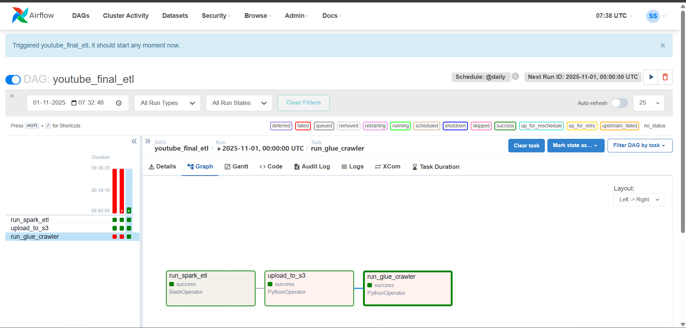

YouTube Analytics ETL Pipeline

## Overview
An end-to-end data engineering pipeline built with:
- **Apache Spark** for ETL and cleaning
- **AWS S3** for data lake storage
- **AWS Glue** for cataloging
- **Apache Airflow** for workflow orchestration

---

## 🔄 ETL Workflow
### Step 1: Spark ETL
- Cleans and transforms raw YouTube data.
- Removes nulls, standardizes columns.
- Writes output as Parquet files.

### Step 2: Upload to S3
- Cleaned Parquet files uploaded to:s3://sameer-data-2025/processed_youtube_data/
Step 3: AWS Glue Crawler
- Scans S3 data.
- Creates schema in `youtube_db` Glue database.

### Step 4: Airflow DAG
- Orchestrates ETL using 3 tasks:run_spark_etl → upload_to_s3 → run_glue_crawler
---

## ✅ Results
- All DAG tasks succeeded in Airflow.
- Verified S3 Parquet files and Glue Table.
- Query successful in Athena.

### Example Athena Query:
```sql
SELECT category_id, COUNT(*) AS video_count
FROM youtube_processed
GROUP BY category_id
ORDER BY video_count DESC;

Screenshots

Airflow DAG (All Tasks Green ✅)

S3 Bucket with Parquet Files

AWS Glue Table Schema

Athena Query Results

Environment

Region: eu-north-1

S3 Bucket: sameer-data-2025

Airflow Environment: WSL Ubuntu

Spark Version: 3.5.x

Python: 3.10

4. Final Validation (Optional but Pro)
Before zipping or pushing to GitHub:
```bash
cd ~/projects/youtube
ls

Make sure it includes:

youtube_etl.py
youtube_sql_viz.py
youtube_final_etl_dag.py
README.md
